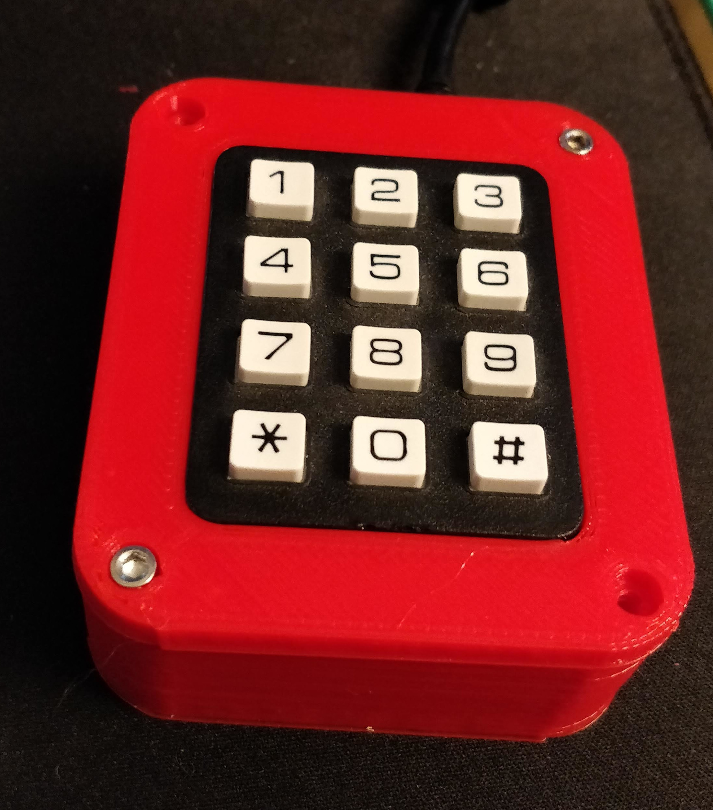

# mediapad

This is a quick arduino project that I did since I wanted media buttons
while also using a keyboard without them.

Files are provided here for a 3D printed case. Please contact me if you need the
full Fusion 360 models; it didn't want to export the geometry in external
files for the keypad, for example.

It requires [Nico Hood's HID library](https://github.com/NicoHood/HID).

It should run on pretty much any arduino model, but I've only tested
on a Leonardo, since that was what I had.

Keymap (I use [Google Play Music Desktop Player](https://github.com/MarshallOfSound/Google-Play-Music-Desktop-Player-UNOFFICIAL-)):

    1, 2, 3 :: unused
    4, 5, 6 :: Ctrl-F22,23,24 (bound to dislike, notify current track, like)
    7, 8, 9 :: Volume down, mute, up
    *, 0, # :: Prev track, pause, next track